<div align="center">

# 📈 AI Trader Toolbox

**Turn a terminal coding agent into a disciplined research, risk, and execution desk.**

*Ask about a stock, sector, watchlist, or portfolio. The desk researches, debates, sizes risk,
and returns an auditable HTML report—not a black-box prediction.*

[](LICENSE)


💡 [Why It Exists](#-why-ai-trader-toolbox) ·
🎯 [What It Does](#-what-it-does) ·
🏛️ [The Desk](#️-the-desk) ·
🌍 [Knowledge Commons](#-the-knowledge-commons) ·
📄 [Sample](#-sample-report) ·
✅ [Why Trust It](#-why-trust-the-process) ·
⚙️ [Setup](#️-setup) ·
📖 [Use It](#-use-it) ·
🧩 [Make It Yours](#-make-it-yours) ·
🔌 [Brokers](#-broker-support) ·
🔒 [Privacy Gate](#-privacy--the-pii-gate) ·
🗺️ [Roadmap](#️-product-roadmap) ·
🤝 [Contributing](#-contributing) ·
🙏 [Credits](#-acknowledgements--citation)

</div>

> ⚠️ **Not financial advice.** This is research tooling. You confirm every order and remain
> responsible for every trade.

> 🔗 **A broker connection unlocks the full desk.** Robinhood works today; IBKR and Futu are
> planned. Without a broker, the desk uses limited web and manual-data fallbacks. Set it up from a
> terminal agent (see [Brokers](#-broker-support)).

---

## 🧭 Read This First

If you want the README to work like an onboarding guide, read it in this order:

| What you need | Read here | Why it matters |
|---|---|---|
| Tool intro | [Why It Exists](#-why-ai-trader-toolbox) and [What It Does](#-what-it-does) | Explains the desk, its discipline, and the main ways to use it. |
| What it can do | [The Desk](#️-the-desk) and [Sample report](#-sample-report) | Shows the operating model and the output format. |
| Setup | [Setup](#️-setup) and [Brokers](#-broker-support) | Gets the agent, broker, and local config in place. |
| User manual | [Use It](#-use-it) and [`docs/user-manual.md`](docs/user-manual.md) | Explains daily reports, approvals, and execution. |

If you are new, start with the intro, complete setup, then use the manual when you are ready to run it.

If you are an AI agent, use this order instead: `README.md` → `AGENTS.md` → `SKILL.md`.

---

## 💡 Why AI Trader Toolbox?

Markets produce more information than one person can consistently process. A single AI answer can
be fast but overconfident. AI Trader Toolbox gives your coding agent a repeatable process:

- **Better decisions, not more predictions.** Every actionable idea needs evidence, a bear case,
  valuation, invalidation, position sizing, and a minimum reward-to-risk threshold.
- **One workflow.** Research, quant analysis, portfolio context, approval, execution, and review
  live in one auditable toolkit.
- **Memory that compounds.** Calls and outcomes are recorded, scored against SPY, distilled into
  lessons, and recalled when a similar setup appears.
- **Readable output.** Each run can produce a bilingual HTML report with the decision first and
  expandable evidence behind it.
- **You stay in control.** Skills are Markdown, engines are Python, private data stays local, and
  every order needs your confirmation.

The open-source starter includes general knowledge only. Add your watchlist and house views in
git-ignored private overlays.

If that is the kind of open trading infrastructure you want to exist, please
**[star it on GitHub](https://github.com/Barneybean/ai_trader_toolbox)** so more traders and
contributors can find it.

## 🎯 What It Does

Four ways to use it:

**1. On-demand analysis**
- *"Do a desk run on NVDA."* · *"How does the semiconductor sector look?"* · *"Review my
  watchlist — anything worth buying?"*
- Covers a sector, stock, watchlist, or portfolio.
- Returns the evidence, entry, stop, target, size, and a clear **buy / wait / pass** call.

**2. Scheduled reports**
- Run recurring reviews of your watchlist and portfolio.
- Receive HTML reports with tactical and long-term actions—or an honest *“nothing clears the bar.”*
- The included scheduler is part of the optional phone bridge, so that bridge process must be
  running. Without it, run or schedule the normal terminal workflow directly.

**3. Confirmed execution**
- **Agent recommends → you approve → broker places.**
- Nothing is bought or sold without your confirmation.
- [See it in action](#robinhood-connect-your-ai-agent-agentic-trading) — a screenshot of
  mode-authorized orders resting in the user's explicitly configured execution account.

**4. Learning**
- Log ideas, vetoes, plans, and outcomes.
- Score mature calls by return and alpha versus SPY.
- Recall lessons when similar setups return.

---

## 🏛️ The Desk

Specialists work independently. A research committee debates each idea, a risk committee sizes
it, and a CIO gate passes only the strongest ideas. No role grades its own work.

<div align="center">
<picture>
  <source media="(prefers-color-scheme: dark)" srcset="docs/desk-flow-dark.svg">
  
</picture>
</div>

### 👥 Analyst Team
Four independent, primary-source lenses ([details](skills/decision/roles.md)):

- **Fundamental** — quality, valuation, strategy, management, scenarios.
- **Quant** — trend, momentum, volume, levels, risk, and cost-basis distribution.
- **Sentiment / News** — dated catalysts, positioning, insider flows, narrative gaps.
- **Macro / Regime** — Fed, yields, volatility, breadth, and crisis conditions.

### ⚔️ Research Debate — *bull vs bear → Research Manager*
The [bull and bear](skills/decision/research-debate.md) challenge each other’s strongest point.
The Research Manager then commits to a stance.

### 🛡️ Risk Committee — *three lenses → Risk Judge*
Aggressive, Neutral, and Conservative lenses debate the
[trade plan](skills/decision/risk-committee.md). The Risk Judge approves, resizes, or vetoes it
using hard limits such as RR ≥ 2 and ≤2% account risk per idea.

### 🧠 Reflection & Memory — *the desk learns*
Calls are logged, scored by return and alpha versus SPY, and distilled into
[reusable lessons](skills/decision/reflection-memory.md).

---

## 🌍 The Knowledge Commons

No trader understands every industry. This repo collects specialist knowledge in one open library
that every fork can use.

Contributed knowledge lives at three levels:

- **Sector playbooks** — [`skills/analysis/sectors/`](skills/analysis/sectors/): drivers,
  catalysts, valuation, and risks.
- **Stock playbooks** — [`skills/analysis/stocks/`](skills/analysis/stocks/): recurring setups,
  catalysts, and dated history—not live calls.
- **Trading & analysis skills** — strategy patterns (`skills/decision/`), edge signals
  (`skills/edge/`), engine improvements.

The loop is simple:

1. Write it from the matching `_TEMPLATE.md`.
2. Review it against the [quality bar](CONTRIBUTING.md#the-playbook-quality-bar):
   **specific · falsifiable · primary-sourced · dated · illustrated · general**.
3. Once merged, every fork can use it.

Coverage maps and the wanted list (banks, REITs, oil & gas, industrials, healthcare, mining, …)
are in [`skills/analysis/sectors/README.md`](skills/analysis/sectors/README.md) and
[`skills/analysis/stocks/README.md`](skills/analysis/stocks/README.md).

Rules, debate protocols, risk gates, and sizing math are readable files. Contributions carry
knowledge, never private positions; the PII gate enforces that boundary.

---

## 📄 Sample report

See what a run produces:
**[`reports/examples/sample-report.html`](reports/examples/sample-report.html)**
- a sanitized, self-contained bilingual HTML analysis of the desk output format.

Open it in a browser, or view without cloning via a raw-HTML previewer (prepend
`https://htmlpreview.github.io/?` to the file's GitHub URL).

It opens with the call — what to do, in one screen:

<p align="center">
  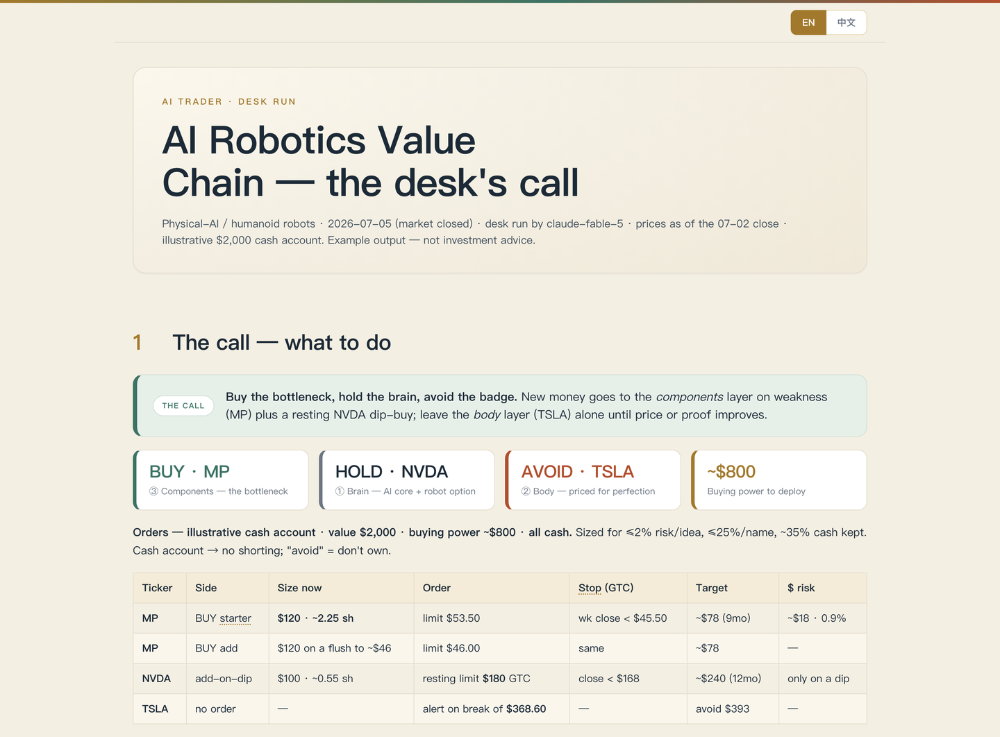
</p>

<details>
<summary><b>📸 More pages from the sample report</b> (role decisions, scorecards, layer map, chip footprint, signals, forecast fan …)</summary>
<br>

**Role-by-role decision** — independent specialist findings, Bull/Bear tension, the PM plan, and
the Research Manager/Risk Judge/CIO adjudication, with each row showing how it changed the action.

<p align="center">
  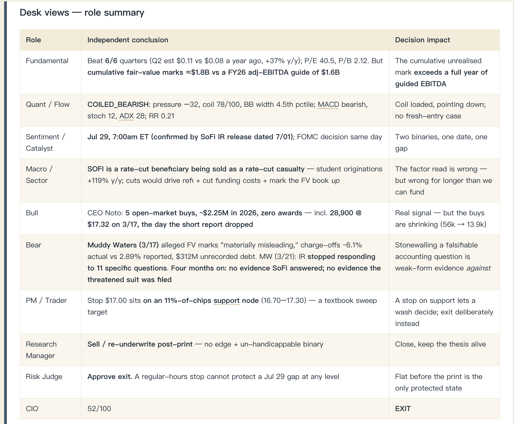
</p>

_Dated SOFI example from July 16, 2026, shown only to illustrate the role-decision format; not a
current recommendation._

**Decision scorecards** — call, trade plan, and money flow.

<p align="center">
  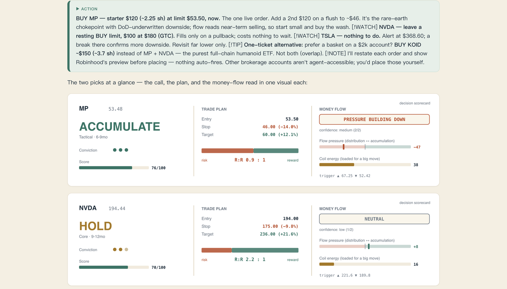
</p>

**Layer map** — the theme split by certainty, purity, and elasticity.

<p align="center">
  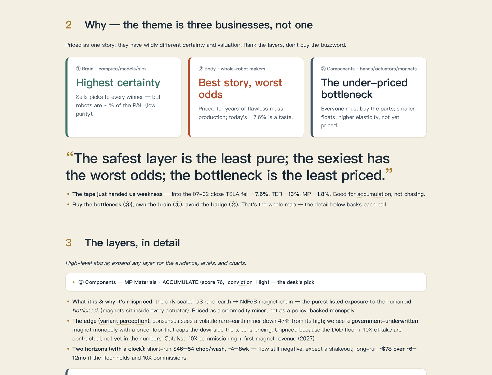
</p>

**Institutional footprint** — cost basis and trapped supply.

<p align="center">
  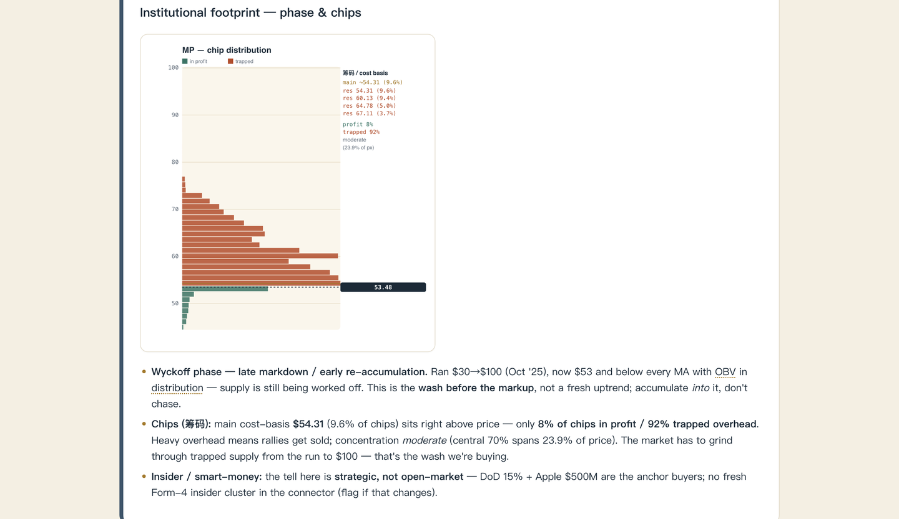
</p>

**Levels and signals** — price, support, resistance, and indicators.

<p align="center">
  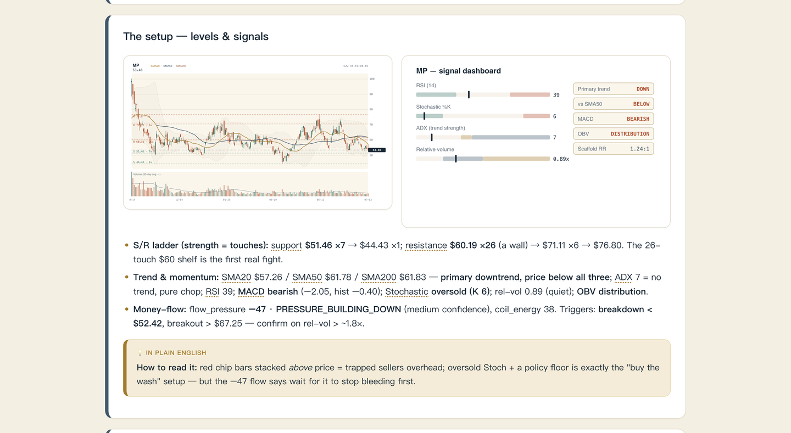
</p>

**Fundamentals and catalysts** — consensus, the desk view, and the plan.

<p align="center">
  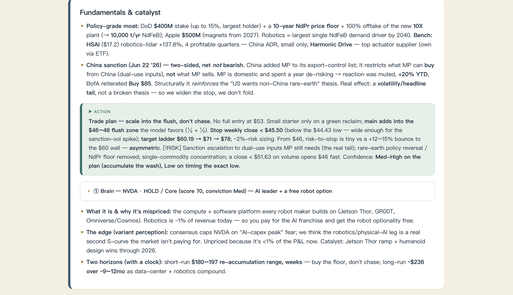
</p>

**Forecast** — Monte Carlo range and historical base rate.

<p align="center">
  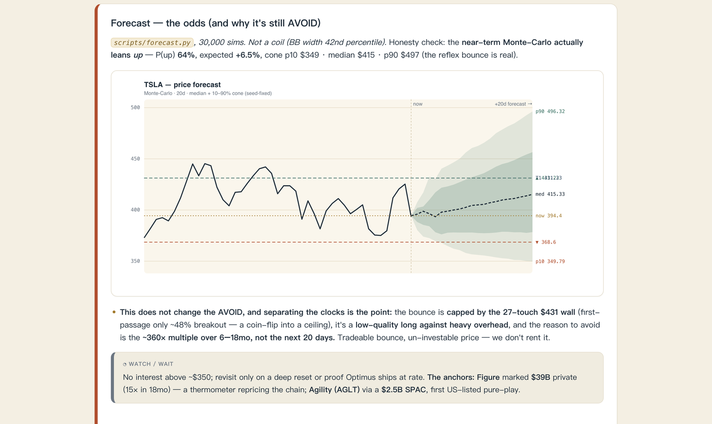
</p>

</details>

The format is **Summary → Action → Evidence**, with plain-language callouts, charts, two time
horizons, and a sized trade plan.

> Illustrative only — the sample account is fictional. The role-summary panel is a dated layout
> example, not a current recommendation or investment advice.

### From your phone

After completing the optional [phone connection setup](docs/phone-connection.md), send the same
plain-language requests you use in the terminal. Reports, analysis, follow-ups, approvals, and
questions behave the same way.

<p align="center">
  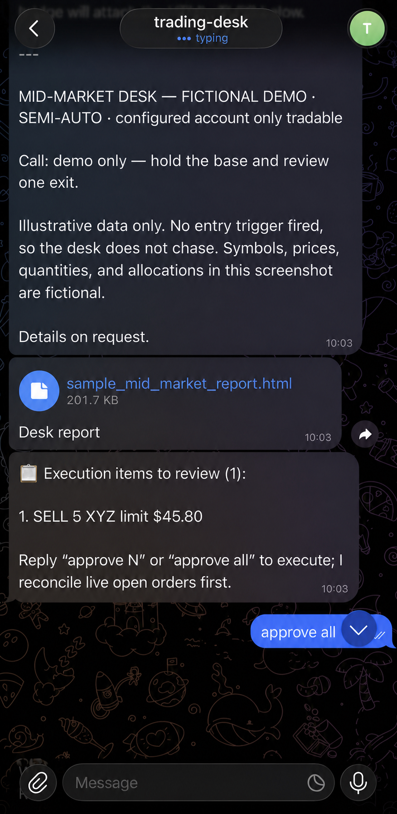
  &nbsp;
  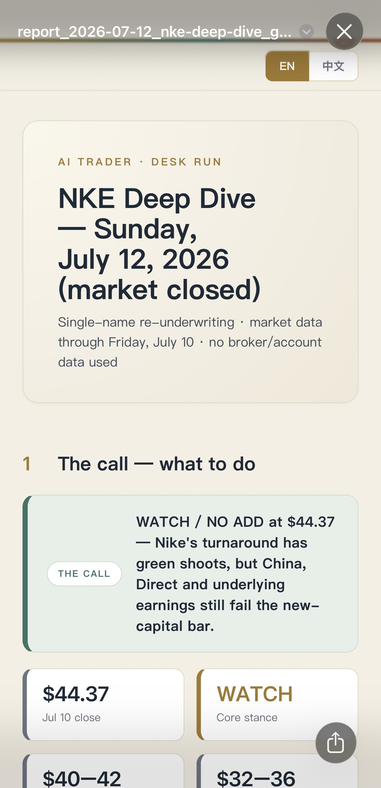
</p>

<p align="center"><sub>Ask from your phone → follow live progress → receive the decision and HTML report → review it on the phone.</sub></p>

| Command | What it does |
|---|---|
| `/status` | Show bridge health, active agent, trading mode, and session status. |
| `/agent` | Open a numbered picker of configured agent/model pairs with passive availability. |
| `/agent N` (or a short-lived bare `N`) | Select that exact default agent/model for future runs. |
| `/agent codex` · `/agent claude` | Open that agent's focused model picker; manual choice does not disable availability fallback. |
| `/new` | Clear the saved Codex and Claude conversations and start fresh sessions. |
| `/mode` | Show the current trading mode. |
| `/mode manual` | Require confirmation for each exact order—the execution kill switch. |
| `/mode semi` | Propose numbered tickets; execute only the tickets you approve. |
| `/mode full` | Run autonomous decisions through the validate-only gateway; no broker order is placed. |
| `/stop` · `/steer TEXT` | Interrupt or redirect the active turn while preserving completed work and resumable state. |
| `/decide N` | Answer a pending numbered agent decision. |
| `/help` | Show the available phone commands. |

Everything else is normal conversation. For example: `Run a daily report`, `Analyze META`,
`Approve 1`, `Close 2`, `Change the limit`, `What changed?`, or `Send me the latest report`.

---

## ✅ Why Trust the Process?

Do not trust it because it says “AI.” Trust what you can inspect and what its record earns:

- **Visible evidence.** Reports separate facts, calculations, assumptions, and judgment. Key
  claims should cite dated primary sources.
- **Challenged decisions.** Bull, bear, risk, and CIO roles expose disagreement.
- **Risk before execution.** No invalidation, sizing, sufficient data, and acceptable RR means no
  actionable ticket.
- **You keep control.** The shipped workflow previews an exact order and requires your explicit,
  order-specific confirmation before placement.
- **Scored outcomes.** Calls are evaluated against a benchmark, not memory or confidence.
- **Auditable implementation.** Skills, formulas, reports, records, and privacy gates are local
  files—not a hidden hosted strategy.

The project does **not** promise profit or perfect data. Start with analysis and let your own
out-of-sample record earn trust.

---

## ⚙️ Setup

Use the AI coding agent in your local IDE terminal as the installer. Clone the repo, start the
agent, and give it the prompt below. Never paste secrets into chat.

The most reliable path is to hand the agent this README and [`SKILL.md`](SKILL.md), then ask it to
set itself up before it runs anything else.

### 1. Clone and enter the repository

```bash
git clone https://github.com/Barneybean/ai_trader_toolbox.git
cd ai_trader_toolbox
```

### 2. Start a compatible coding agent in the same terminal

```bash
codex
# or
claude
```

Any terminal agent that reads repository instructions and runs local commands can work.
[`SKILL.md`](SKILL.md) is the charter; [`AGENTS.md`](AGENTS.md) routes compatible agents to it.

#### Fewer permission prompts (optional)

```bash
# Codex: start normally and approve only this workspace plus required commands
codex

# Claude: pre-approve routine repository file tools
claude --permission-mode acceptEdits \
  --allowedTools "Read" "Edit" "Write" "Glob" "Grep"
```

Prefer repository-scoped file access and a small allowlist of recurring commands. Grant broader
access only when a concrete setup step needs it and you understand the effect. Never use
unrestricted approval bypass while a live broker is connected. Check current options with the
agent's built-in help.

### 3. Feed this README to the agent

Paste this request into the terminal agent:

```text
Read README.md, AGENTS.md, and SKILL.md completely. Set up this AI Trader Toolbox from this
terminal. Detect what is already installed; create only the required git-ignored local
configuration; install and verify the privacy hooks; explain how to connect my supported broker
without printing secrets; run the available consistency and PII checks; then run a safe
analysis-only smoke test. Do not place any order. Tell me exactly what still needs my input.
```

The repository tells the agent how to detect capabilities, use fallbacks, protect privacy, and
stop before broker actions.

### 4. Connect market data and broker capabilities when prompted

Robinhood's agentic-trading connector is currently the working broker integration. Complete its
official connection flow from your terminal agent when it asks:

➡️ **[Robinhood — Agentic Trading Overview → Connect your AI agent](https://robinhood.com/us/en/support/articles/agentic-trading-overview/#ConnectyourAIagent)**

The agent should verify market data, portfolio data, and an order **preview**. It must not place
an order without your confirmation of that exact ticket.

For runtime-specific wiring and capability detection, see [`PORTABILITY.md`](PORTABILITY.md).

The desk pulls data, runs the pipeline, and returns a ranked, risk-checked report — or an honest
"nothing clears the bar." No broker connector? It falls back to web data + a historicals JSON you
supply (see *Portability & capability detection* in `SKILL.md`).

### Full-potential checklist

- [ ] A terminal coding agent can read `README.md`, `AGENTS.md`, and `SKILL.md` and run Python.
- [ ] `config.local.toml` and the optional bridge's `chat-bot-bridge/.env` exist only locally and remain git-ignored.
- [ ] Privacy hooks are installed and `python3 scripts/ops/scan_pii.py` passes.
- [ ] A supported broker is connected for live portfolio data and confirmed execution, or the
      documented web/manual-data fallback is understood.
- [ ] The optional phone bridge under `chat-bot-bridge/` is configured only with local secrets and
      allowlists, or left uninstalled if you do not need phone access.
- [ ] The first analysis-only report builds successfully and its sources and risk plan are reviewed.
- [ ] Personal watchlists, house views, and paid/private knowledge live only in private overlays.
- [ ] Calls are logged and later scored so confidence can be earned from outcomes.

After the manual flow is reliable, consider weekday pre-market and post-close runs plus a weekly
review. The included schedules are bridge-backed, and scheduled reports still require confirmation
before execution.

### Repository layout

```text
ai-trader-toolbox/
├── skills/             # research, decision, playbook, and execution instructions
├── scripts/
│   ├── analysis/       # market and quantitative engines
│   ├── journal/        # recall, alerts, scoring, and weekly review
│   ├── lib/            # shared data and logging modules
│   ├── ops/            # setup, privacy, consistency, smoke tests, and packaging
│   └── report/         # report scaffolding, charts, build, and archive lifecycle
├── chat-bot-bridge/    # optional provider-neutral phone connection template
│   ├── server.js       # stable compatibility entrypoint
│   ├── src/            # app + agents/broker/control/delivery/reports/runtime domains
│   └── test/           # mirrored domain tests
├── docs/               # manuals, policies, ADRs, and sanitized demonstrations
├── journal/            # local user memory and outcomes; private files are git-ignored
└── reports/            # current HTML, archived HTML, examples, and ignored build/cache state
```

The grouped paths are canonical. Legacy flat commands such as `scripts/indicators.py` remain as
compatibility launchers, so existing integrations continue to work while new documentation uses
`scripts/analysis/indicators.py`. Generated `dist/`, `logs/`, report caches/builds, local agent
settings, credentials, sessions, and personal trading data are intentionally not mirrored from a
developer's Trading Desk.

---

## 📖 Use It

Ask your terminal agent in plain language:

1. `Run a daily report.`
2. `Run a complete report on AI robotics opportunities.`
3. `Run a full analysis on META.`
4. `Schedule a complete daily report before the market opens each trading day.`
5. `Switch to full shadow mode and validate the proposed tickets.`
6. `Evaluate my rolling position plan from this local JSON file.`

Reports and analyses always use the full decision-grade pipeline. The normal flow is **report →
user review → approve exact tickets → AI previews and executes only those tickets → report and log
fills.** Experimental full mode is currently a validate-only shadow: it independently decides and
gates proposed tickets, records rejects, and never calls broker placement. Live autonomy remains
disabled until the published integration and sandbox gates are complete.

For staged entries and exits, [`position_manager.py`](scripts/analysis/position_manager.py) can
replay a complete local ledger, compare the after-fee result with buy-and-hold, and cap proposed
tranches by cash, concentration, and stop risk. It is an advisory calculator: you supply the levels,
private account data stays in your local input file, and it never sends an order.

---

## 🧩 Make It Yours

The repo ships **generic starter templates** — replace them with your own edge:

| File | Put here |
|---|---|
| `skills/playbook/house-views.md` | Your macro/technical heuristics |
| `skills/playbook/watchlist-theses.md` | Names you track + thesis + invalidation |
| `skills/playbook/mentor-method.md` · `skills/playbook/mentor-casebook.md` | The method/investor you study |
| `skills/analysis/sectors/` | Add a sector playbook via `sectors/_TEMPLATE.md` |
| `skills/analysis/stocks/` | Add a stock playbook via `stocks/_TEMPLATE.md` |

Keep confidential watchlists, paid research, and private deals under git-ignored
`skills/private/`.

---

## 🔌 Broker Support

Connect a broker for live data, portfolio context, and confirmed execution.

| Broker | Status | Notes |
|---|---|---|
| **Robinhood** | ✅ working (via connector) | Quotes, historicals, fundamentals, positions, previews, and mode-gated execution. |
| **Interactive Brokers** | 🔌 planned | Adapter interface + config slot ship now; implementation welcome. |
| **Futu / moomoo** | 🔌 planned | Same. |

### Robinhood: connect your AI agent (agentic trading)

Robinhood's **agentic trading** connector lets an AI agent read your data and place orders (with
confirmation). Follow Robinhood's official setup:

➡️ **[Robinhood — Agentic Trading Overview → *Connect your AI agent*](https://robinhood.com/us/en/support/articles/agentic-trading-overview/#ConnectyourAIagent)**

> 💡 Connect from a terminal agent. Store the authorized account only in git-ignored
> `config.local.toml`. Every order requires confirmation.

**Confirmed execution in practice:** the agent recommended, previewed, and placed these limit
orders only after user approval. The 🤖 marks agent-placed orders.

<div align="center">
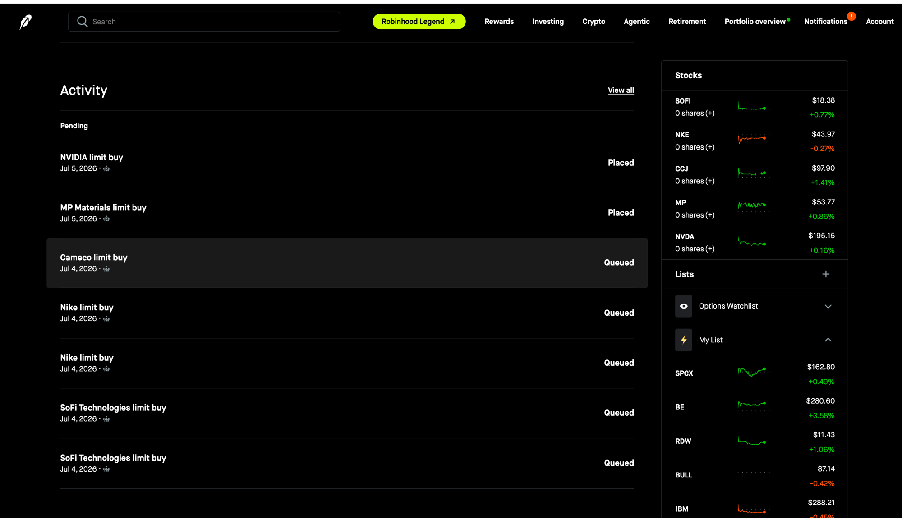
</div>

The design goal is **one broker-adapter interface** — add a broker by implementing a single class.
See [`CONTRIBUTING.md`](CONTRIBUTING.md).

---

## 🔒 Privacy & the PII Gate

The repo protects private data with three layers:

- **Secrets live only in git-ignored files** — `config.local.toml`, `chat-bot-bridge/.env`, and private overlays under `skills/private/`.
- **A scanner** — [`scripts/ops/scan_pii.py`](scripts/ops/scan_pii.py) — flags account numbers, keys,
  connector UUIDs, and personal identifiers in tracked files.
- **Three gates** — pre-commit, pre-push, and
  [CI](.github/workflows/pii-scan.yml).

```bash
bash scripts/ops/install_hooks.sh      # turn on the local gate
python3 scripts/ops/scan_pii.py        # scan on demand before publishing
```

Add your exact private strings to `scripts/ops/pii_denylist.local.txt` (git-ignored) for hard
blocking.

---

## 🗺️ Product Roadmap

The roadmap shows what works, what is in progress, and where help matters.

| Status | Area | Outcome | Help wanted |
|---|---|---|---|
| ✅ Available | Auditable desk foundation | Multi-lens research, debate, risk gates, bilingual HTML reports, mode-gated execution, privacy checks, and outcome journaling | Tests, documentation, playbooks, and independent review |
| 🚧 WIP | Historical learning and continuity | Efficient recall of prior analyses, trades, methods, decisions, and outcomes during every relevant run | Retrieval evaluation, schemas, deduplication, and long-history benchmarks |
| 🚧 WIP | Reliability and portability | Observable engine runs, consistent setup across terminal agents, safer publishing, and clearer degraded-mode behavior | Cross-platform tests, fixtures, and installation diagnostics |
| 🎯 Next | Financial-report analysis | Deeper reusable skills for 10-K/10-Q/8-K, earnings releases, footnotes, guidance changes, segment economics, cash-flow quality, and transcript contradictions | Accounting expertise, filing fixtures, citation tests, and sector-specific rubrics |
| 🎯 Next | Diversified decision-grade data | Prefer accurate, free, primary, and timely sources; reconcile conflicts and expose source, freshness, and fallback quality in every call | Source adapters, licensing review, reliability scoring, caching, and fallback design |
| 🎯 Next | Efficient near-real-time decisions | Incremental analysis that reacts to meaningful price, news, filing, flow, and portfolio changes without rerunning everything | Event routing, latency benchmarks, streaming adapters, and cost controls |
| 🔬 Research | Loss-aware execution | Improve entries, exits, sizing, slippage control, and kill switches to improve risk-adjusted outcomes—not claim guaranteed maximum profit | Paper-trading harnesses, execution simulations, broker adapters, and measurable acceptance criteria |
| 🔬 Research | Black-swan and crisis response | Detect surprise-event regime shifts, preserve liquidity, reduce correlated losses, hedge when justified, and define recovery/re-entry playbooks | Historical crisis scenarios, stress tests, market-microstructure expertise, and chaos drills |
| 🔬 Research | Public activity and conflict signals | Legally monitor timely public disclosures from corporate insiders, elected officials, funds, and prominent market commentators—including figures such as Donald Trump, Nancy Pelosi, and Tom Lee—then test whether a signal adds value after reporting delay, bias, and false positives | Official disclosure sources, entity resolution, legal/ethics review, lag-aware backtests, and manipulation safeguards |
| 🎯 Next | Broker platform | Harden Robinhood, define one tested adapter interface, then add IBKR and Futu/moomoo with quotes, positions, previews, confirmations, fills, and reconciliation | Maintainers with sandbox accounts, broker API experience, and integration-test fixtures |

“Insider” work here means analysis of **lawfully available public disclosures**, never access to or
use of material non-public information. Named people are examples of public-signal categories,
not endorsements or allegations. No signal should enter the decision process until it is tested
out of sample and its source, publication delay, survivorship bias, and failure modes are visible.

Want to help? Open an issue with a source, test case, or design and read
[`CONTRIBUTING.md`](CONTRIBUTING.md). To follow the build and help others find it,
**[star the repository](https://github.com/Barneybean/ai_trader_toolbox)**.

---

## 🤝 Contributing

Issues and PRs are welcome. Every change follows **issue → branch update → reviewed MR/PR → merge**;
start with the [`Developer guide`](DEVELOPMENT.md). Pick a roadmap item or add a playbook through
[The Knowledge Commons](#-the-knowledge-commons). State the problem, evidence, acceptance criteria,
failure modes, and tests. Run `python3 scripts/ops/scan_pii.py` before pushing. Significant
updates also trigger `python3 scripts/ops/smoke_test.py` from the git hooks, which asks for human
review before the push leaves the machine. Follow
[`CONTRIBUTING.md`](CONTRIBUTING.md).

### Bringing improvements from another desk, fork, or branch

Do not copy the source tree into this repository. Start with the read-only audit:

```bash
python3 scripts/ops/sync_audit.py --source /path/to/source
```

It classifies reusable candidates, sanitization-required files, public assets to preserve, and
private/runtime state that must never cross. It also detects shared-remote risk, obsolete directory
aliases, unsafe defaults, populated secret templates, and local denylist terms. Follow the canonical
[open-source boundary and sync policy](docs/open-source-boundary.md); the tool never copies or publishes files.

---

## 🙏 Acknowledgements & Citation

The structured **bull/bear research debate**, **multi-perspective risk committee**, and
**reflection/memory** design are inspired by **TradingAgents** (Tauric Research). If you build on
this work, please also credit theirs:

```bibtex
@misc{xiao2025tradingagents,
  title        = {TradingAgents: Multi-Agents LLM Financial Trading Framework},
  author       = {Xiao, Yijia and Sun, Edward and Luo, Di and Wang, Wei},
  year         = {2025},
  eprint       = {2412.20138},
  archivePrefix= {arXiv},
  primaryClass = {q-fin.TR}
}
```

---

## ⚖️ Disclaimer & License

AI Trader Toolbox is for **research and education only** and is **not financial or tax advice**. By
default it does not auto-trade — you approve and place every order. If you modify it to automate
execution, you do so at your own risk and own every outcome. Past performance and backtests do
not guarantee future results.

Licensed under the terms in [`LICENSE`](LICENSE).
